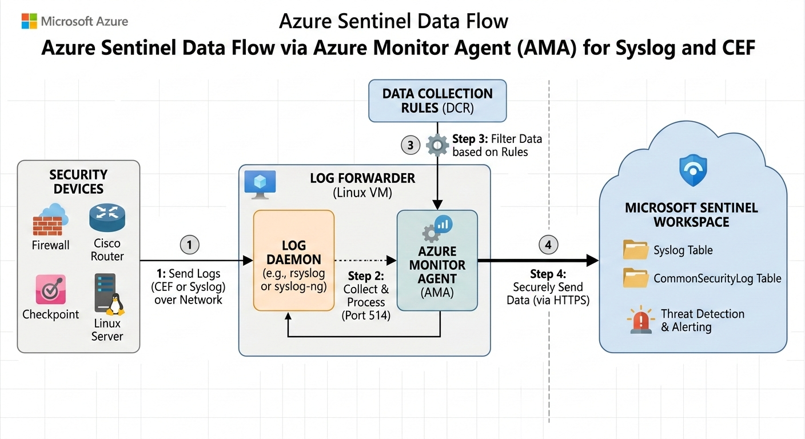

# Sentinel Log Ingestion: Multi-Stream Syslog & CEF via AMA


## 📌 Project Overview
This project demonstrates a production-ready deployment of **Microsoft Sentinel** using the **Azure Monitor Agent (AMA)** to ingest both standard **Linux Syslog** and **Common Event Format (CEF)** data. 

By utilizing **Data Collection Rules (DCRs)**, this architecture allows for granular control over log ingestion, enabling noise reduction at the source and significant cost optimization for cloud storage.

---

## 🏗️ Architecture & Data Flow
The deployment utilizes a centralized Ubuntu 24.04 Log Forwarder to bridge the gap between local/network assets and the cloud.

<p align="center">



<i><b>Figure 1:</b> Logical flow of Syslog and CEF telemetry from the Ubuntu Log Forwarder to the Log Analytics Workspace via the Azure Monitor Agent (AMA).</i>
</p>

1.  **Sources:** Security appliances (Firewalls, IDS) send logs via Syslog/CEF.
2.  **Listener:** The `rsyslog` daemon captures traffic on **Port 514**.
3.  **The Agent (AMA):** Processes and relays logs based on the logic defined in the **Data Collection Rule (DCR)**.
4.  **The Cloud:** Data is parsed into the `Syslog` and `CommonSecurityLog` tables in Sentinel.

---

## 🛠️ Implementation Details

### 1. Environment Configuration
* **Log Analytics Workspace:** Configured as the central telemetry repository.
* **Network Security (NSG):** * Restricted SSH (Port 22) to management IP only.
    * Opened Port 514 (UDP/TCP) to receive internal network logs.
* **Identity:** Enabled **System-Assigned Managed Identity** on the Forwarder VM.

### 2. Data Collection Rule (DCR) Setup
I implemented a dual-stream DCR to categorize incoming data streams accurately.

| Facility | Severity | Destination Table |
| :--- | :--- | :--- |
| Auth / AuthPriv | Info+ | `Syslog` |
| Local0 - Local7 | Info+ | `CommonSecurityLog` (CEF) |


### 3. Log Forwarder Deployment
The link between the Linux environment and Azure was established using the Microsoft-provided Python installation script, which automates the `rsyslog` and AMA integration.

```bash
# Installation command executed on the Forwarder VM
sudo python3 Forwarder_AMA_installer.py

```

---

## 📊 Validation & KQL Analysis

To ensure the pipeline was functional, I simulated events for both standard and structured logs.

### Manual Injection (CLI)

```bash
# Standard Syslog Test
logger -p local0.info "SYSLOG_PIPELINE_SUCCESS: Validation Complete"

# CEF Security Test
logger -p local0.info "CEF:0|PortfolioProject|SecurityLab|1.0|200|Auth Success|5|src=10.0.0.5 msg=Authorized Access"

```

### Sentinel Results

**Query for CEF Verification:**

```kql
CommonSecurityLog
| where DeviceVendor == "PortfolioProject"
| project TimeGenerated, SourceAddress, DeviceEventClassID, Message

```

---

## 🚧 Challenges & Resolutions

* **Managed Identity Permissions:** Initially encountered a "403 Forbidden" error during data upload. Resolved by granting the VM the **"Monitoring Metrics Publisher"** role.
* **Regional Availability:** Encountered capacity constraints in East US Zone 1; successfully pivoted deployment to **Zone 2** to maintain project timeline.
* **Ingestion Delay:** Accounted for the standard 5-10 minute propagation window required for new DCR associations.

---

## 📂 Repository Content

* `/queries`: Custom KQL scripts for monitoring and detection.
* `/scripts`: Automation scripts for generating test traffic.

## 📜 License

This project is licensed under the MIT License.

```

---

### 2. The `queries/validation.kql`
Create this file to show you can write clean KQL.

```kql
// Verify standard Syslog ingestion
Syslog
| where TimeGenerated > ago(1h)
| summarize count() by Computer, Facility, SeverityLevel

// Verify CEF parsing for security appliances
CommonSecurityLog
| where DeviceVendor != ""
| project TimeGenerated, DeviceVendor, DeviceProduct, LogSeverity, Message
| order by TimeGenerated desc

```

---

### 3. The `scripts/logger_test.sh`


```bash
#!/bin/bash
# Script to generate test logs for Sentinel validation
echo "Sending test Syslog message..."
logger -p local0.info "SENTINEL_VALIDATION: Syslog stream is active."

echo "Sending test CEF message..."
logger -p local0.info "CEF:0|AzureLab|LogForwarder|1.0|100|Heartbeat|1|msg=Validation pulse"

echo "Check Sentinel logs in 5-10 minutes."

```

---

### 4. The `LICENSE`

```text
MIT License

Copyright (c) 2026 MATOME SAMSON LETSOALO

Permission is hereby granted, free of charge, to any person obtaining a copy
of this software and associated documentation files (the "Software"), to deal
in the Software without restriction, including without limitation the rights
to use, copy, modify, merge, publish, distribute, sublicense, and/or sell
copies of the Software, and to permit persons to whom the Software is
furnished to do so, subject to the following conditions:

The above copyright notice and this permission notice shall be included in all
copies or substantial portions of the Software.

THE SOFTWARE IS PROVIDED "AS IS", WITHOUT WARRANTY OF ANY KIND, EXPRESS OR
IMPLIED, INCLUDING BUT NOT LIMITED TO THE WARRANTIES OF MERCHANTABILITY,
FITNESS FOR A PARTICULAR PURPOSE AND NONINFRINGEMENT. IN NO EVENT SHALL THE
AUTHORS OR COPYRIGHT HOLDERS BE LIABLE FOR ANY CLAIM, DAMAGES OR OTHER
LIABILITY, WHETHER IN AN ACTION OF CONTRACT, TORT OR OTHERWISE, ARISING FROM,
OUT OF OR IN CONNECTION WITH THE SOFTWARE OR THE USE OR OTHER DEALINGS IN THE
SOFTWARE.
Permission is hereby granted, free of charge

